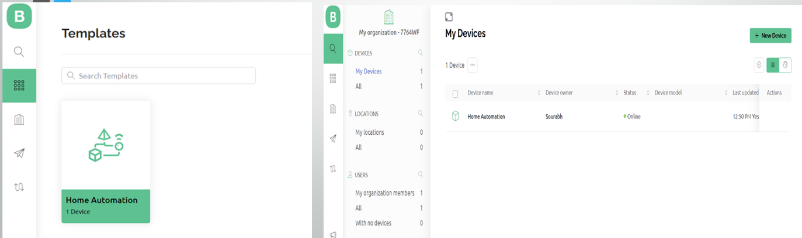
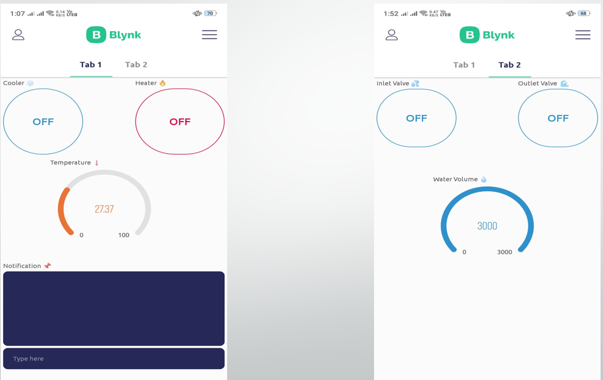
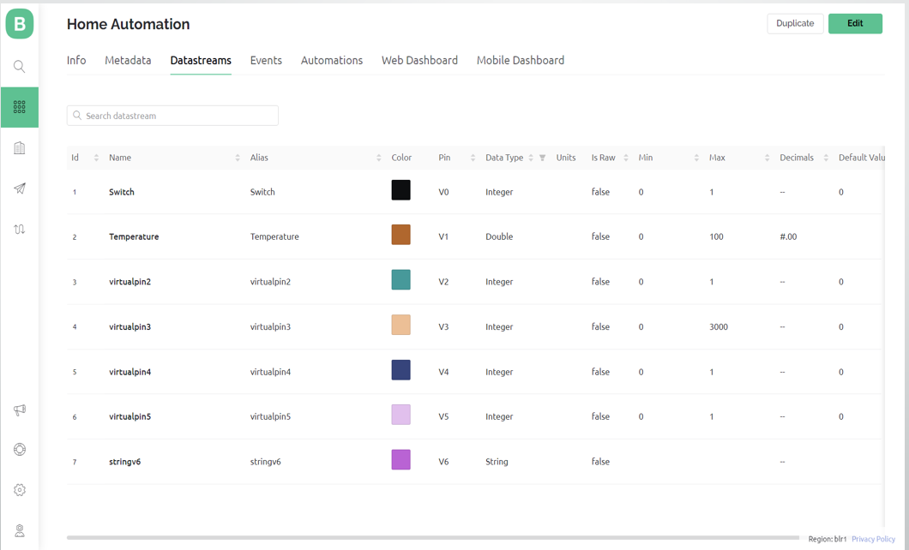
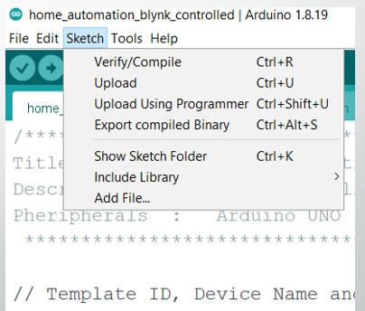
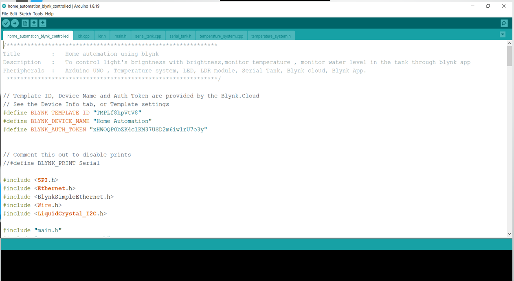
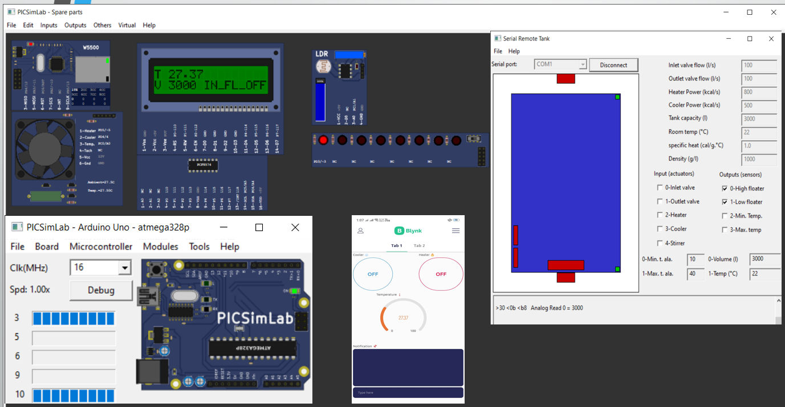

# IoT based Home Automation Solution

## Problem Statement
To control home devices using Blynk IoT app through Blynk Cloud Server.

## Tech Stack

**Hardware used in PICSim Lab Emulator:**
- LDR Sensor
- LED
- CLCD hd 44780
- Arduino UNO (atmega328p)
- Ethernet Shield (ETH w5500)
- Temperature System (Heater and Cooler)
- Water Tank (Serial Remote Tank)

**Software/Tools Used:** 
- Arduino IDE
- PICSim Lab Emulator
- Null Emulator (Setup)
- Blynk Application (both Mobile and Web version)
 Active internet connection is also required.

**Languages Used:**
- Embedded C/C++
  
## Project Requirements

- Garden Light Control:- It is based on LDR sensor. Here during day time lights must be OFF and during night time lights must be ON.
- Temperature System Control:- By using BLYNK Application. Here, we can turn on and off the heater and cooler using BLYNK app. We also print the notification on the mobile application on the dashboard. Here, if the heater is on and temperature raises above 35 degree Celsius, then notification is sent to the mobile phone and heater is turned off automatically.
- Water Tank Control :-Here the tank inlet and outlet valve is controlled using button widget. Suppose the volume of the water tank is less than 2000L, then a notification is sent on the app that water level is less than 2000 and then inlet valve will be on automatically . After this , once volume becomes 3000 that is full, inlet valve will turn off automatically and a notification that water level is full and inlet is disabled is displayed on the app.

## Breif Description
- Garden Lights Control: 
    - It is based on LDR sensor.LDR is used to indicate the presence or absence of light, or to measure the light intensity. 

    - Goal:- Here during day lights must be off and during night lights must be on.
    
    - Working:- During night Resistance will be more , so the LED will turn ON. Similarly, during day time  resistance will be less, so the LED will turn OFF. So as it becomes darker and darker , brightness of the led increases.And more and more brighter the sunlight, brightness of led decreases.

-  Temperature Control:
    - Here we read temperature from temperature system and display it on the CLCD and also on mobile app. We can turn on and off the heater and cooler using app.
    
    - A notification is printed on the mobile application on the dashboard if the heater is on and if temperature raises above 35 degree c , the notification ‘Temperature is above 35 degree Celsius . Turning OFF the Heater’ is sent to the mobile phone and the heater is turned off automatically.
    
     - When Heater is in ON condition -> HT_R ON will be displayed on CLCD.
   
    - When Heater is in OFF condition -> HT_R OFF will be displayed on CLCD.
    
   -  When Cooler is in ON condition -> CO_LR OFF will be displayed on CLCD.
    
    - When Cooler is in OFF condition -> CO_LR OFF will be displayed on CLCD.
    - Formula used for converting digital values from adc to temperature degree celsius
    - temperature = (((analogRead(A0) *(float)5/ 1023)) /(float) 0.01)

- Water Tank Control: 
    - Here we read the volume of the tank and display it on the CLCD and at the same time also on the mobile application.
    - Here we control the tank inlet and outlet valve using button widget. Message is displayed on CLCD whether the inlet or outlet is on or off.
    - When Inlet Valve is in ON condition -> IN_FL_ON will be displayed on CLCD.
    - When Inlet Valve  is in OFF condition -> IN_FL_OFF will be displayed on CLCD.
   - When Outlet Valve is in ON condition -> OT_FL_OFF will be displayed on CLCD.
   - When Outlet Valve is in OFF condition -> OT_FL_OFF will be displayed on CLCD.
    - Suppose the volume of the water tank is less than 2000L, then a notification ‘Water Level is less than 2000L. Water Inflow Enabled’ will be printed on the app dashboard and then inlet valve will be switch on automatically. then once volume becomes 3000 that is full, ‘Water Level is FULL. Water Inflow Disabled’ will be printed on the dashboard and inlet valve will be turned off automatically. 

## Steps to setup Blynk IoT App

- Create BLYNK Account in Web Version.
- Create template as ‘Home Automation’.
- Add new device.
- We must remember to copy Template ID, Device Name and Authentication Token. (Important step)
  
- Add Datastreams
   
- Setup the widgets required in Mobile Phone and hence we are ready to control the device.
   

## Steps in Arduino IDE
- Install the required Library files like SPI.h, Ethernet.h, BlynkSimpleEthernet.h .
- Coding.
- Save the file.
- Compile
- Export the compiled Binary.
- Load the HEX file in PICSimlab Simulator.
   

## Screenshot of Output
 

